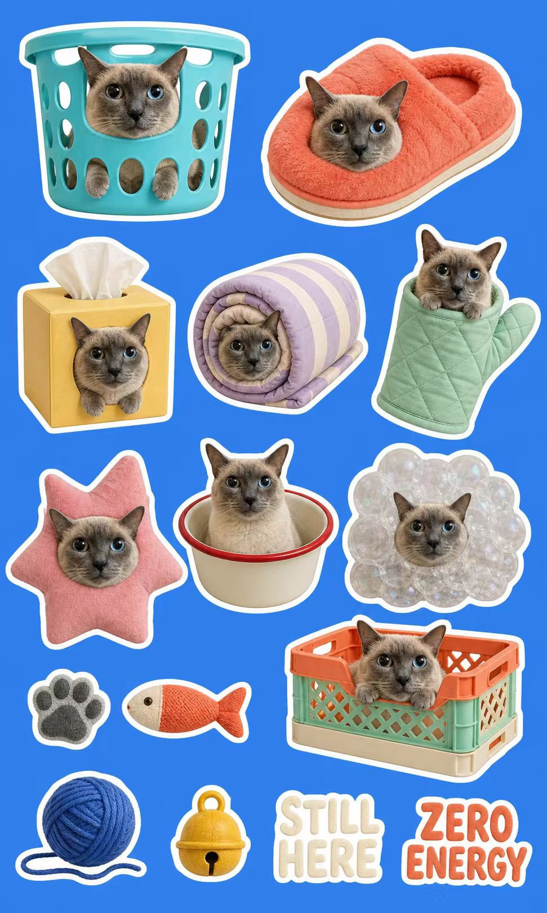
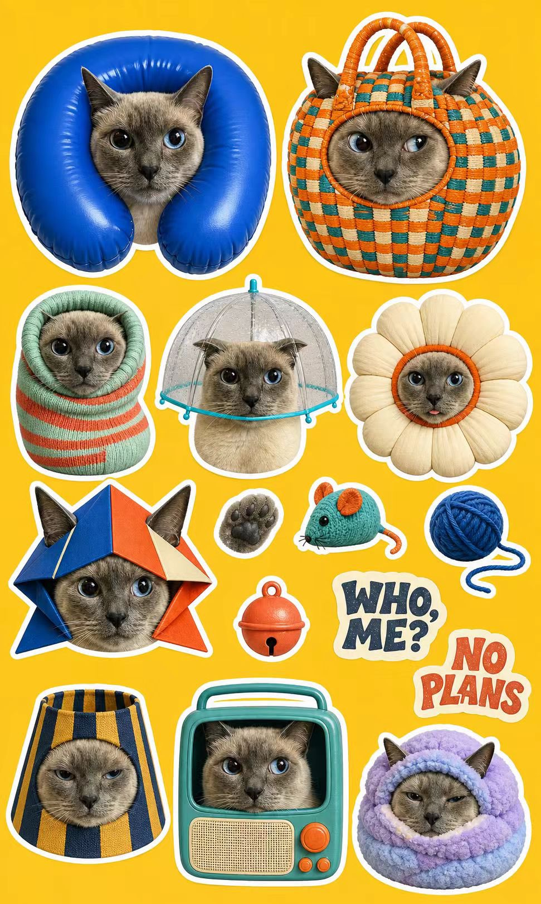
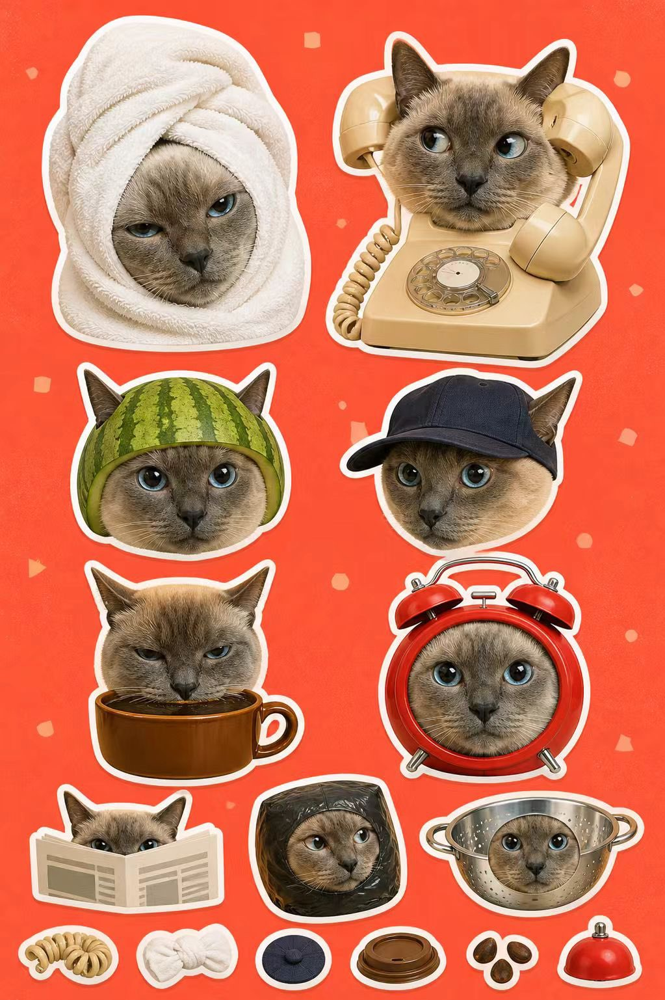
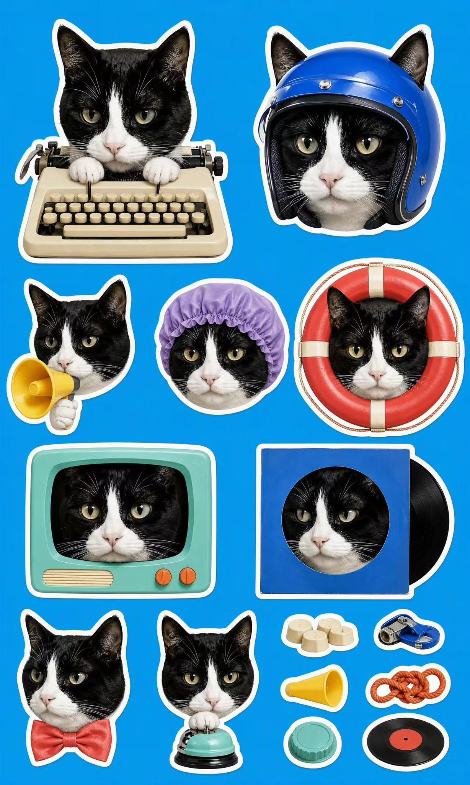

<!--
[INPUT]: 依赖根目录 SKILL.md 的产品契约与 GitHub 单 Skill 安装路径，依赖 assets/preview-*.jpg 的效果示例
[OUTPUT]: 对仓库访问者提供用途、效果预览、安装、调用、设计法则与目录结构的最小说明
[POS]: cat-sticker-sheet 的人类入口，只做发现和导航，不复制执行细节
[PROTOCOL]: 变更时更新此头部，然后检查 CLAUDE.md
-->

# Cat Sticker Sheet

把一张猫咪照片变成一张复古摄影拼贴贴纸版：同一只猫使用普通人类道具产生轻微错位，再用少量明显、图形化、接近超现实肖像的 face-in-cover 构图提升趣味。

它保留猫咪可见的品种/类型、毛色、花纹、脸型、耳朵和眼睛特征，不推断猫咪性格。人类动作只是可选灵感；普通物件可以被穿戴、拿持、操作，也可以少量放大、包裹或变形成仍然一眼可辨的外壳。每张始终只有一个不对劲的地方。

固定输出为 3:5 竖版、2 大 + 4 中 + 3 小猫头主贴纸、6 枚微贴纸，以及统一单层白色模切描边。

## 效果预览

<p align="center">
  
  
</p>

<p align="center">
  
  
</p>

## 安装

```bash
npx skills add https://github.com/hiyeshu/cat-sticker-sheet -g -a codex --skill cat-sticker-sheet -y
```

## 使用

附上一张清晰的单猫照片，然后调用：

```text
用 $cat-sticker-sheet 保留这只猫的外貌特征，让它使用普通人类道具产生轻微错位，并用少量图形化 face-in-cover 肖像提升趣味；每张只保留一个笑点。
```

## 设计原则

先守住猫咪身份，再建立构图与笑点，最后统一整张贴纸版的视觉语言。

1. **身份先于创意。** 猫咪特征只来自照片；微表情只用于当下表演，不推断性格。
2. **构图只留下猫头。** 猫头始终是主体，颈部和身体由道具遮住，或在下颌线干净裁切。
3. **道具必须日常可信。** 使用一眼可辨的人类物件，保留真实材质；穿戴、拿持或操作都可以，人类动作只作可选灵感。
4. **每张只有一个错位。** 一个道具、一次互动、一个笑点；需要解释两句话就继续删减，不引入奇幻设定和复杂混搭。
5. **套壳只做视觉高点。** 仅用少量 face-in-cover：写实猫脸居中嵌入干净开口，物件外壳遮住或替代身体。
6. **整页共享一种质感。** 写实猫脸、低保真摄影拼贴与统一单层白色模切描边贯穿全部贴纸。
7. **背景保持绝对干净。** 默认使用接近 `#279DDA` 的纯天蓝色；用户指定颜色时严格遵循，不使用场景、渐变、暗角、光晕、颗粒感或光线衰减。

## 目录

```text
SKILL.md     Skill 入口与执行流程
agents/      Codex UI 元数据
assets/      README 效果预览与维护者视觉校准资料
references/  身份、单步错位、渲染与轻量交付检查
```
